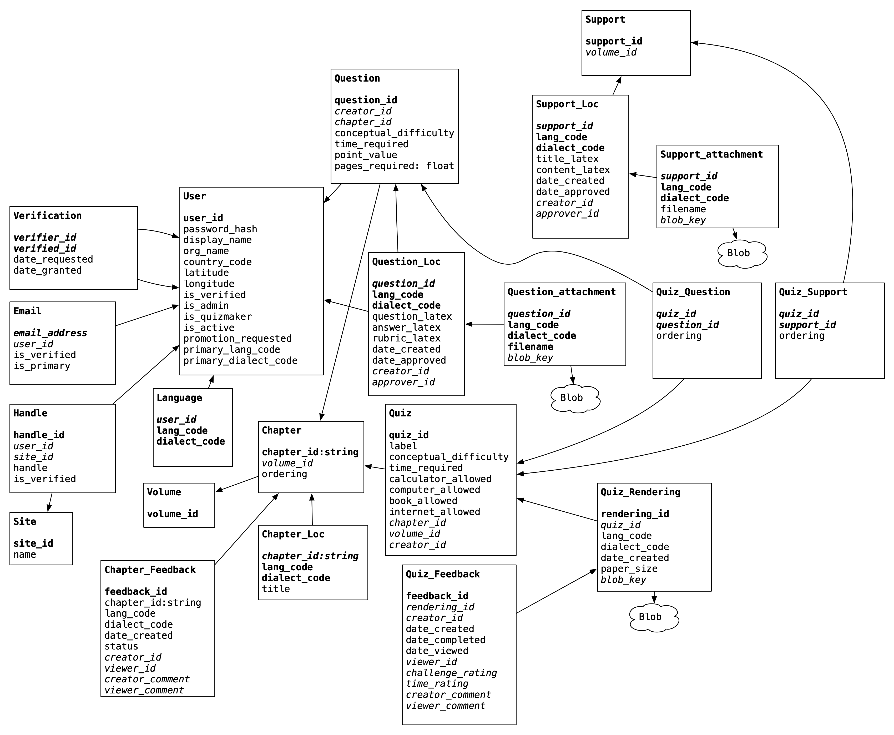

# Mentoris

The Kontinua Foundation is creating a curriculum for self-paced study
of math, computer science, and physics.

The mentors for the students using this curriculum will need quizzes
(and answer keys) for each chapter. Mentoris is the web app that will
supply them with those quizzes and answer keys.

Here is our [Technical Specification](https://docs.google.com/document/d/1gqyTfjpYk12v72GUw912kEI0EFNYl_ET/edit?usp=sharing&ouid=118232505108273987896&rtpof=true&sd=true) which outlines the entire project in more detail.

## Set Up
1. Install Python 3.11 [Python Release Python 3.11.0 | Python.org](https://www.python.org/downloads/release/python-3110/)
2. Follow the Django installation guide: [Quick install guide | Django documentation | Django (djangoproject.com)](https://docs.djangoproject.com/en/5.0/intro/install/). We are using Django version 4.2.5
3. Install the Elastic Beanstalk CLI: Install the [EB CLI - AWS Elastic Beanstalk (amazon.com)](https://docs.aws.amazon.com/elasticbeanstalk/latest/dg/eb-cli3-install.html)
4. Locate the config file in the `.AWS folder` (location varies based on operating system, usually in the home directory). Ask the team for the AWS Elastic Beanstalk credentials
    - Run the command `eb init` in the root directory of the project
        - Select 3 `(us-west-2 : US West (Oregon))`
        - Select 1 `(mentoris)`
        - Select 1 `(Mentoris-env)`
        - Do not continue with CodeCommit
    - update the dependencies in requirements.txt (this can be done by running the command `pip freeze > requirements.txt` assuming you are working in a virtual environment with only the minimum packages installed to have Mentoris running, otherwise the dependencies need to be manually added)
    - Use the command `eb deploy` to deploy code into AWS Elastic Beanstalk  when ready
    - The current state of the project after deployment can be viewed here: [ http://mentoris-env.eba-tsm5gnpk.us-west-2.elasticbeanstalk.com/main/]( http://mentoris-env.eba-tsm5gnpk.us-west-2.elasticbeanstalk.com/main/)
    - Github: [GitHub - TheKontinua/mentoris: The web app for mentors](https://github.com/TheKontinua/mentoris)
5. Complete the official Django tutorial: [Writing your first Django app, part 1 | Django documentation](https://docs.djangoproject.com/en/5.0/intro/tutorial01/)
6. Meet with the team to get tasks for your first sprint.
7. You are now ready to start writing code!
8. Pull from main on: [Kontinua Mentoris Github: GitHub - TheKontinua/mentoris: The web app for mentors](https://github.com/TheKontinua/mentoris)
9. Ask the team for the AWS RDS credentials to use in settings.py
10. Perform tasks using your IDE or text editor of choice
    a. Write clean code with comments as needed
    b. Test the code before making a pull request
11. Remove the AWS RDS credentials before making a pull request
12. Make a pull request and wait for it to be approved by another team member
13. Once the pull request has been merged to main the code is ready to be deployed to Elastic Beanstalk!

## Infrastructure

The web application will be open source. The primary programming
language used in this curriculum is Python, so the web app will be
written in Python using the Django web framework.

We will be using PostgreSQL as the backend database.

The questions and answers will be stored as LaTeX segments. The complete quiz will
need to be typeset using TeX. Preview will be done with LaTex.js.

We will deploy the system on Amazon Services.

## Requirements

There are four kinds of users:

-   Newbie: new users who have not been promoted to a mentor
-   Mentor: those who proctor and grade the quizzes
-   QuizMaker: those who assemble the quizzes
-   Admin: those who can promote and disable other users

Things a Newbie needs to be able to do:

-   Edit profile
-   Change password
-   Request endorsements from existing mentors

Things a Mentor needs to be able to do:

-   Everything a Newbie can do
-   Download a PDF of a quiz for a particular chapter in a particular language
-   Suggest a question/answer/rubric for a particular chapter in a particular language in LaTeX
-   Translate a question and answer from one language into another
-   Give feedback on a quiz
-   Give feedback on a chapter
-   See mentor feedback

Things a QuizMaker needs to be able to do:

-   Everything a Mentor can do
-   Browse submitted questions, edit them, and approve them
-   Create supports
-   Assemble approved questions/supports into a quiz
-   Make previously approved questions not visible

Things an Admin needs to be able to do:

-   Everything a Quizmaker can do
-   See a list of Newbies waiting to be Mentors (with any endorsements)
-   Promote, demote, or disable a user
-   Delete quizzes
-   Delete mentor feedback

## Screens

#### Login page

-   Takes your email and password -> Main page
-   Links for create account -> New user page
-   Link for forgot password -> Lost password page

#### New user page

-   gets display name (must be unique), orgname, country code
-   one email
-   password (twice)
-   primary language
-   password is salted with user id and hashed with Argon2
-   Sends email to confirm email
-   Confirmation link takes you to profile page

#### Lost password page

-   Textfield for email address
-   Emailed link to reset password page
-   -   -> "Look in your email!" page

#### All inside pages

-   Account link to edit user info
-   Pending authentications? List of people who requested your authentication
-   Request for question translation? List of questions to be translated
-   Request for quiz feedback?
-   Quizmaker? List of questions needing approval (just admin's languages)
-   Quizmaker? List of new feedback on quizzes
-   Admin? Notification of new Newbies

#### Main page

-   Outline view of volumes/chapters
-   Get quiz for volume (randomly chosen, 2 PDFS, each to take 45 minutes)
-   Get quiz for chapter (randomly chosen, 1 PDF to take 45 minutes)
-   Submit question for chapter

#### Edit question page

-   Text area for LaTeX of question
-   Text area for LaTeX of answer
-   Text area for LaTeX of rubrik
-   conceptual difficulty rating
-   time required estimate
-   point_value (should be proportional to time)
-   iso language popup
-   Attachments -- allow uploading images to be included

#### Translate question page

-   Text area for LaTeX of question
-   Text area for LaTeX of answer
-   Text area for LaTeX of rubrik

#### Account page

-   Change password
-   Add/remove email addresses
-   Change primary email
-   Change display name
-   Change org name
-   Request authentication
-   Add/remove languages
-   Change primary language
-   Give lotitude/longitude
-   Change country code

#### Quiz feedback page

-   "You gave your students quiz 56A39B for the chapter 'Induction':
-   Appropriate difficulty?
-   Was supposed to take 45 minutes: Took appropriate amount of time?
-   Other comments?

#### Quiz designer page

-   Quizmakers only
-   Pick Chapter or Volume
-   Click "generate new quiz"
-   See preview
-   Ability to insert, update, delete question choices
-   Most quizzes include a low-difficulty question from previous chapters

### Question approval page

-   Get show question
-   Approve-> Next question needing approval
-   Edit -> Edit QuestionPage

#### Quiz feedback browser:

-   See only new feedback by default
-   Start with most negative feedback
-   Include link to quiz designer to improve quiz

#### Question browser

-   Select a chapter see all questions

## Entity-Relationship Diagram

